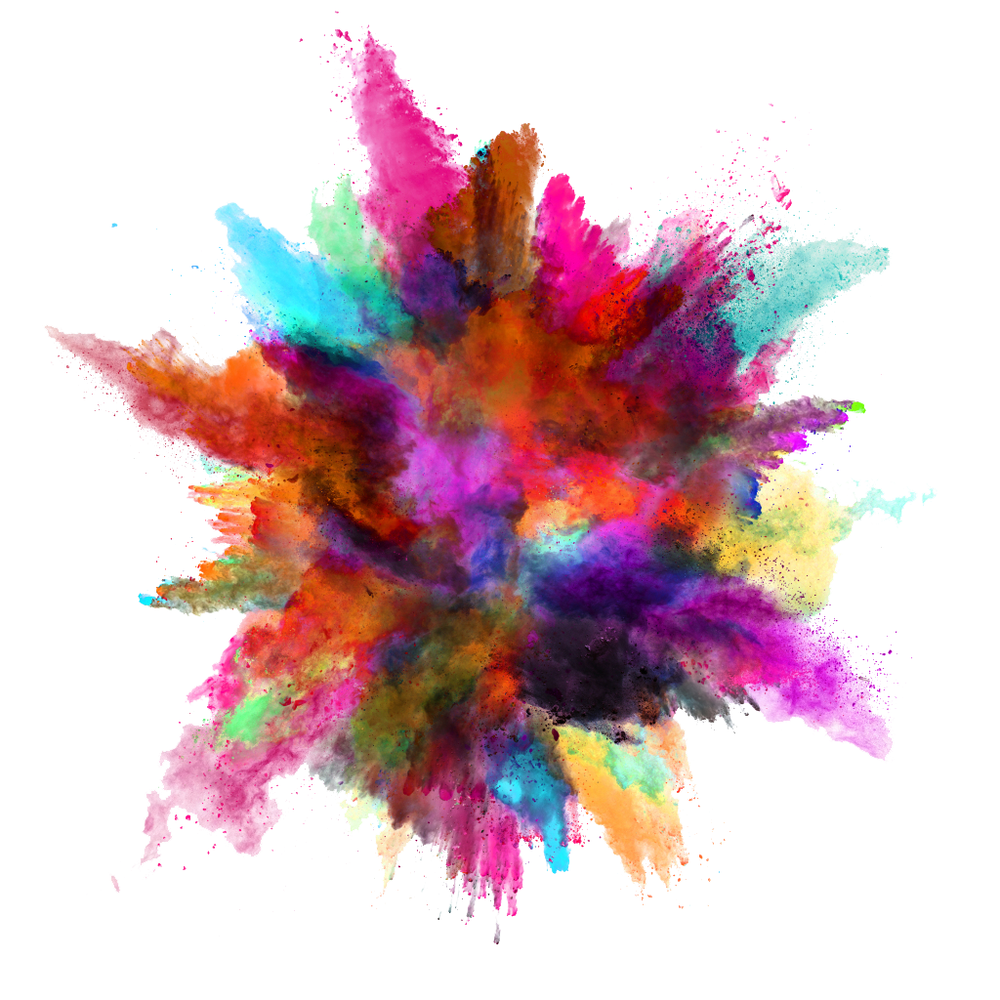

# Color Picker - Nonis

## :exclamation: Color Picker - Nonis

Color Picker - Nonis is a powerful tool designed for developers and UI/UX designers. It allows you to generate colors, copy them, and add them to your palette for easy access whenever you need them.

## :triangular_flag_on_post: Target of Color Picker

Color Picker - Nonis aims to provide the following features:

- Generate Colors: Easily generate colors to find the perfect shades for your projects.
- EyeDrop Feature - Capture Colors from the Current Tab:
- Effortlessly extract and utilize colors from the current tab, simplifying your color selection and matching designs to web page elements.
- Copy Color Codes: Copy the color codes (hex, RGB, etc.) with a single click for seamless integration into your codebase.
- Create Palettes: Add colors to your palette and organize them for quick reference and reuse.

## :hammer_and_wrench: Technologies Used

Color Picker - Nonis is built using the following technologies:

-  Typescript
-  React
-  GitHub Actions
-  Git
-  CSS3
-  HTML5

## :rocket: Getting Started

These instructions will help you get started with Color Picker - Nonis:

### Installation

1. Clone the repository.
2. Install the required node modules by running the following command:

## :computer: Development

In the project directory, you can run the following scripts:

- `npm run build`: Bundles the extension for production.
- `npm run start`: Starts the development mode and watches for changes.

## :book: Learn More

To learn more about how Nonis was created, you can refer to the following documentation:

- [Create React App documentation](https://facebook.github.io/create-react-app/docs/getting-started)
- [React documentation](https://reactjs.org/)

## :bulb: Contributing

Contributions, comments, and suggestions are welcome! Feel free to open an issue or submit a pull request with any improvements you'd like to make.

We hope you find Color Picker - Nonis useful in your design and development workflows!
